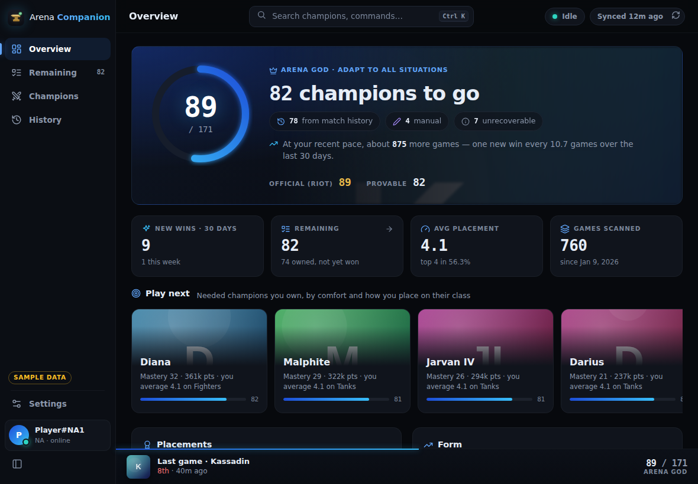

# Arena Companion

Read-only League LCU companion for Arena win tracking, running on Windows as a desktop app (Electron shell + local web backend).

> **Just want the app?** Download **Arena Companion Setup.exe** from the [latest release](https://github.com/donglecum/arena-companion/releases/latest). Works with whichever Riot account your League client is logged into.

> Updates install silently on app start; the restart waits until League is out of champ select and games (packaged builds check GitHub Releases; the portable build doesn't auto-update).

## What it does

- Connects to the running League client via the LCU API (lockfile auth, local TLS only).
- Detects the logged-in player automatically and reads Riot's **official** "Adapt to All Situations" (Arena God, challenge 602002) count directly from the client.
- Rebuilds the **provable** win checklist by scanning Arena match history through the existing `arena-tracker` server (`https://arena.scrolab.com`), plus Data Dragon champions and manual wins.
- Desktop app (Electron) with a dark UI; the same UI is available locally at `http://localhost:8788`. The server listens on 127.0.0.1 only and rejects requests from other sites (foreign `Host`/`Origin`, non-JSON bodies), so web pages and the LAN cannot drive its API.

## Screens

The app is a left navigation rail (collapsible), a top bar with the Ctrl+K search, the League client status and sync state, and a bottom **live bar** that shows what League is doing right now (champ select pick and whether it counts, a game in progress, the wait for a finished game's match record, or your last game) with Arena God progress along its top edge. The rail follows the Arena God task: **Overview, Remaining, Champions, History**, with **Settings** apart at the foot. **Champ Select** joins the rail only while League is in champ select (its route, number key and the live bar link always work).

- **Overview** — Arena God ring with the official count (it turns gold once every champion is won), an honest breakdown (from match history / manual / unrecoverable), official vs provable counts, and the pace toward Arena God ("about N more games at your recent pace"). Four numbers: new wins in the last 30 days (and this week), champions remaining (and how many of them you own — opens Remaining), average placement (and top-4 rate), games scanned. **Play next** picks (needed champions you own, ranked by mastery and how you place on their class, each with its reason), then placement distribution (1st / top 4 / 8th rates; 1st gold, 2nd–4th blue, 5th–7th slate, 8th coral), a form chart of your last 30 placements with the current win streak (and best) and top-4 run, recent games, and your latest play session.
- **Remaining** — every champion still needed, grouped by primary class. The header gives what is left for Arena God and splits the list into never played / played without a win and owned / not owned; each of those counts is also a filter, as are the per-class counts. When Riot counts more wins than match history can show, a note says how many of the listed champions were won before match history (mark remembered ones on their pages). Search, and sort by name, closest to a win (best placement), mastery or most played. Cards show the best placement so far. With nothing left, it celebrates Arena God.
- **Champions** — grid or sortable table (name, games, wins, win rate, average placement, last played, mastery). Grid cards lead with the champion art: still needed is full color over a coral edge, won recedes behind a teal ✓ Won, manual marks are purple, and unowned champions are grey with a lock. Filters: All / Needed / Won / Manual, class (Fighter, Mage, Assassin, Tank, Marksman, Support — also clickable in the per-class progress bars), owned only, played / never played. Layout, filters and sort are remembered.
- **Champion page** — splash hero, classes, status, mastery, then **Your Arena history**: best and average placement, games, top 4 (placements 1–4), wins, first-win date, the last result, a strip of recent placements and the placement histogram — then every Arena game on that champion. Manual mark / unmark (click twice to confirm) is saved on this PC (`cache/manual-<player>.json`) and copied to arena-tracker when it accepts the write, so a tracker error never loses a mark.
- **Match History** — a year-long activity calendar (games per day, new first wins outlined), filters by champion, placement (1st, top 4, bottom 4, 8th, first wins) and date range, and games grouped by day with daily summaries.
- **Champ Select** — the main window stays hidden or where you left it; open it from the tray when needed. During Arena champ select (`CHERRY`, queue 1700 or 1750), only a small always-on-top **Crowd Favorites** panel appears automatically. It answers "do I still need any of these?": the header says how many are still needed (or "All won"), needed favorites are large, full-color and coral-edged with a Need tag, won ones shrink and dim behind a ✓, and ones without win data stay neutral with a ?. It hides after champ select and while the game runs. On Windows it docks outside the League client's right edge with a 9 DIP gap, falling inside when there is no room; it follows moves/resizes across monitors. Drag vertically to save its offset from the client top; if the client window is unavailable, the panel uses its last free position. The Champ Select view shows the current pick (and whether a win on it counts), the crowd favorites, and needed champions you own; **Mini mode** turns it into a compact card.
- **Post-game** — on leaving an Arena match, runs an incremental rescan. Riot publishes the match only after its last team falls, so if the game is not in match history yet, the scan looks again after 30 s, 1, 2, 4 and 8 minutes (the live bar says it is waiting). A first win on a new champion gets a short celebration — champion art, 1st place, Arena God before → after (only when that step is exact: Riot's count has moved, or Riot counts no wins older than match history) and champions left — plus a Windows notification. Any other game gets a quiet card above the live bar (placement and champion, already won or still needed, champions remaining, the latest session's new wins / games) that leaves on its own. The app never raises its window after a game: both wait until you next open it (the notification opens it) and go stale after 20 minutes.
- **Settings** — Riot ID override (leave empty to follow the account logged into League), region (auto-detected from the client, or pinned), **Start with Windows** (on by default: installed copies launch at sign-in straight into the tray, so the Crowd Favorites panel is ready for champ select), mini-mode default and always-on-top switches, full rescan, version and data folder, and a **Crowd Favorites panel** button to show a clearly labeled sample preview (five sample rows, so it is as tall as a real lobby) for positioning. With the client visible, drag the preview up/down to set its relative height, then click **Done**; without the client, dragging sets the fallback position. A real Arena champ select takes over while active; if the preview remains enabled, it resumes afterward. Preview mode is not saved and starts off after an app restart. With sample data, **Sample states** switches between scenarios (see Tests).

## Keyboard

| Keys | Action |
|---|---|
| `Ctrl+K` / `Ctrl+P` | Command palette: jump to any champion or view, update scan, full rescan, toggle mini mode / always on top / overlay preview, export the checklist as CSV |
| `1`–`5` | Overview, Remaining, Champions, Match History, Settings |
| `6` | Champ Select |
| `/` | Search champions |
| `[` | Collapse or expand the sidebar |
| `?` | Shortcut sheet |
| `Esc` | Close dialogs, leave mini mode |

## Design system

Black and electric blue, used with restraint. Tokens are CSS custom properties at the top of `src/ui/app.css`:
- Surfaces, darkest first: `--bg #07090d`, `--rail #0b0e14`, `--surface #10141c`, `--surface-2 #161b26`, `--hover #1c2230`, `--selected #232b3b` (selected filters and nav), borders `--border #1f2633`, `--border-soft` and `--border-strong` (hover on clickable surfaces)
- Blue: `--blue #3b82f6`, `--blue-bright #60a5fa` (active/focus, links), `--cyan #38bdf8` (live state, first wins), `--blue-deep #1d4ed8`, `--blue-btn #2563eb` (primary buttons, white text at 5:1), `--blue-tint` (update notes)
- Text: `--text #e6edf7`, `--text-2 #8b97ab`, `--text-3 #7a869a` (all at least 4.5:1 on the surfaces)
- Status: won `--won #2dd4bf`, needed `--needed #f87171`, manual `--manual #a78bfa`, `--warn #fbbf24`; gold `--gold #e8b949` only for Arena God and 1st place
- Placement tiers: `--t1` gold, `--t2` blue, `--t3` slate, `--t4` coral
- Type: Inter for everything, numbers included (tabular figures, so columns line up); JetBrains Mono only for keyboard keys and paths. Both are bundled in `src/ui/fonts/` (SIL OFL, see `LICENSES.txt`); no web font requests. Labels are sentence case at 12–13px; no all-caps eyebrows.
- Components: `.card` (a surface: things you click, art, the Arena God hero), `.section` (a flat block on the page: heading, optional one-line subtitle, content), `.tile` (the four Overview numbers, one strip divided by hairlines; `.link-tile` when it opens a view), `.chip` (status), `.btn` (primary/ghost), `.pill-btn` filters, `.switch`, `.champ-card` (art-first champion card, `src/ui/js/cards.js`; its status reads from the art), `.art` (champion art with a colored-initials fallback, so offline or missing art never leaves a hole), skeleton shimmer
- Layout: the rail is 196px wide (56px collapsed); hierarchy comes from type, spacing and surface contrast before borders, and sections sit on the page rather than in boxes, so a surface never holds another surface. Radii are 6, 8 and 12px. Gold stays reserved for Arena God and 1st place: the completed ring, first-win celebration, 1st-place marks.
- Icons: inline Lucide-style line icons (`src/ui/js/icons.js`) for navigation, icon-only buttons, status (lock, ✓) and the scan spinner; headings, labels and other text buttons go without.
- Charts: hand-rolled SVG/HTML (`src/ui/js/charts.js`) — progress ring, placement bars, form chart, activity calendar; flat fills, no gradients
- Effects: the Arena God ring is the only thing that glows. No glassmorphism or decorative gradients; gradients appear only where text sits on champion art, in the missing-art placeholder and in the loading shimmer.
- Motion: 150–250ms ease-out, count-up on the Arena God number, a short settle on the first-win art and its new count. Hover changes color or border, never position. `prefers-reduced-motion` turns it all off. Views only rebuild when their data changes, so the 3-second poll never reloads images.
- Copy: plain sentences in the UI; no em dashes, exclamation marks or subtitles that restate the chart.

## Architecture

- `shell/main.cjs`, `shell/windows.cjs`, `shell/dock.cjs`, `shell/notify.cjs` — Electron shell, read-only Win32 window/process discovery via prebuilt Koffi FFI, pure client-relative dock geometry, and the first-win notification text. Native client pixels are converted to Electron DIP per target display. `ARENA_COMPANION_DOCK_TARGET` overrides `LeagueClient.exe` for safe-window smoke testing.
- `src/server.ts` — backend: LCU polling plus persistent read-only LCU WebSocket subscription to `/lol-lobby-team-builder/champ-select/v1/crowd-favorite-champion-list`; match win checklist, static UI + JSON API on 127.0.0.1:8788. `src/httpGuard.ts` gates requests; `src/respond.ts` encodes responses (static files go out byte for byte); `src/config.ts` validates settings.
- `src/ui/` — the SPA: `index.html`, `app.css`, and plain ES modules in `src/ui/js/` (no build step): `main.js` (routing, shell, shortcuts, post-game cards), `store.js` (polling), `views/*.js` (one per screen), `palette.js`, `livebar.js`, `charts.js`, `icons.js`, `util.js`, `cards.js` (champion card). DOM-free logic lives apart so it is unit-tested: `nav.js` (routes, sidebar order, number keys), `progress.js` (Arena God numbers, what is remaining, post-game progress) and `crowd.js` (the Crowd Favorites view model, shared by the main window and `overlay.html`, the Crowd Favorites panel — a classic script, so it also loads from `file://` in the shell's smoke mode).
- `assets/` — app logo (gold anvil + green check): `icon.ico` (multi-size, used for the Electron window and tray icons), `icon-256/512/32.png`, `icon.svg` (favicon at `/icon.svg` with `/icon-32.png` fallback, served by `src/server.ts`). The shell sets the AppUserModelId to `com.arena.companion` for Windows taskbar identity.
- `src/postgame.ts` — gameflow transition, win-diff detection, finding the finished game in match history and the follow-up scans while it is missing (unit-tested). Post-game events (`lastEvent` in `/api/status`) carry the previous provable count, every new champion, Riot's count before the game, the finished game (champion, placement) and whether the scan is still waiting.
- `src/insights.ts` — streaks, pace toward Arena God, latest session and Play next picks, served by `GET /api/insights`; `GET /api/matches` serves every scanned Arena match (both read-only, polled only when the checklist changes)
- `src/fixture.ts` — deterministic sample data and scenarios for `ARENA_COMPANION_FIXTURE` (see Tests)
- `src/lockfile.ts`, `src/lcu.ts`, `src/ws.ts` — read-only LCU primitives; the WebSocket subscriber reconnects after client restarts
- `src/trackerApi.ts`, `src/scan.ts`, `src/ddragon.ts`, `src/regions.ts` — checklist data via arena-tracker + Data Dragon; `scan.ts` aggregates stored match placements into the dashboard rates using games scanned as the denominator (no rescan required for existing caches).
- `src/manualWins.ts` — manual wins kept on this PC (marks and removals by champion id), merged over arena-tracker's list on every scan; scans still work when the tracker's list is unavailable.
- `src/probe.ts`, `src/checklist.ts` — CLIs

## Shell choice

**Electron** provides native windows/tray/always-on-top. The backend stays plain Node; `Start-ArenaCompanion.ps1` launches Electron if installed, otherwise the backend alone (no overlay).

## Running on Windows

- Start at sign-in: installed copies register a Windows login item (`--hidden`, tray only) unless **Start with Windows** is off; check it under Task Manager › Startup apps. Dev and portable runs never register one. The old **ArenaCompanion** scheduled task is no longer needed — delete it (`schtasks /delete /tn ArenaCompanion /f`) so only one copy starts at sign-in.
- Only one copy runs: starting it again (shortcut, installer) brings the open window forward. Updates are checked at start and every 4 hours; while one downloads or waits to install, the sidebar shows it ("Downloading v…", "Update v… ready"), and Settings › About shows the installed version and update state.
- The main window reopens at the size and position it was left (saved in `main-window.json` in the app data folder); a window left on a disconnected monitor comes back on screen.
- Data: the Electron shell keeps `companion-config.json` and the match `cache/` in the per-user app data folder (`%APPDATA%\<app name>`), which survives updates; older copies in the app folder are copied there once. Running the backend alone (`npm start`) still uses the working directory, or `ARENA_COMPANION_CONFIG` / `ARENA_CACHE`.
- Runtime logs: `logs\arena-companion.log` / `.err.log`. Favorite IDs and resolved statuses, WebSocket connection, overlay shown/hidden, and safe errors are recorded there; no lockfile password or auth header.
- Node 24 runs TypeScript directly. Install with `npm install` in the app directory; Koffi includes prebuilt Windows binaries and needs no compiler. If Electron's binary is missing, run `node node_modules\electron\install.js`. The Electron overlay needs a logged-in desktop session.

## Tests

**Sample data (no League client needed):** `ARENA_COMPANION_FIXTURE=1 npm start` serves a realistic player (171 champions, 760 Arena games, partial Arena God progress with wins older than match history, generated placeholder art) at `http://localhost:8788`. Set it to a scenario name — or use **Settings › Sample states** (sample data only; also in the Ctrl+K palette) — to see every other state: `champselect` (a live Arena champ select; crowd favorites 2 needed, 2 won, 1 unknown), `crowd-needed`, `crowd-won`, `first-win` (the post-game celebration), `result` (a game on a champion already won), `result-needed` (2nd on a champion still needed) and `complete` (Arena God). Each resets the sample player. Open `http://localhost:8788/overlay.html` to see the Crowd Favorites panel in a browser. It never touches the LCU, the tracker or Data Dragon, and manual marks stay in memory. Screenshots in `docs/screenshots/` were taken this way.

`npm run typecheck` — `tsc` over `src/` and `tests/` (no output; Node runs the `.ts` files directly). CI runs it and `npm test` on every push and pull request.

`npm test` — unit tests for request gating, config validation, the Start-with-Windows login item, main-window placement, region detection, the data-folder migration, update-restart deferral, the champion cache (with classes and titles), lockfile parsing/redaction, scan/manual-win and placement aggregation, local manual marks (merging over the tracker's list, removals, a tracker that is down), retrying match batches that failed on an earlier scan (including empty and invalid-placement stores), favorite payload/status resolution, client-relative dock/clamp geometry, both Arena queues, post-game transitions, finding the finished game and the bounded follow-up scans, first-win notification text, the sample scenarios, and the UI logic in `src/ui/js` (`tests/*.test.mjs`): Arena God numbers and the unrecoverable gap, remaining classification (never played / played without a win) and class totals, filters and sorts, the Arena God completion state, post-game progress deltas and result cards, manual-mark actions, routes and number keys (checked against `index.html`), and the Crowd Favorites view model (row states, the needed/all-won summary, when the panel shows, preview).

## Capability matrix (live check 2026-09-27)

| Capability | Status |
|---|---|
| Detect client running (lockfile) | Works |
| LCU connect/auth | Works |
| Gameflow phase | Works |
| Current summoner identity | Works (read from LCU) |
| Riot official Arena God count (challenge 602002) | Works |
| Provable/manual wins via arena-tracker | Works |
| Champ-select current pick/intent | Works (404 gracefully outside champ select; verified session schema live) |
| Manual wins | Saved on this PC; arena-tracker answers `not_found` to writes for some players, so the copy there is best effort |
| LCU WebSocket events | Connected to live client on 2026-09-27 |
| Crowd Favorites event + overlay | Real champ select received five favorites, showed ✓/✗ statuses, then hid. The separate GET safety net returned 404 during that lobby; 404 now disables GET for that session without spamming logs, leaving WS authoritative. |
| Client window docking | Live log identifies `LeagueClientUx.exe` as the 1920×1080 client UI during champ select; the panel docks outside with a 9 DIP gap when display space permits, otherwise inside. It follows moves/resizes, and hides when `League of Legends.exe` starts. |
| Old wins lost to match-v5 retention | Their champions cannot be recovered from the aggregate challenge count; mark remembered wins manually |
| LCU swagger/docs | Unavailable (Riot disabled `/swagger/v3/openapi.json` in current client builds) |

## Next features (not built)

- Queue-mate readiness: LCU lobby endpoints can show party members' readiness
- Multi-account / friends' checklists

